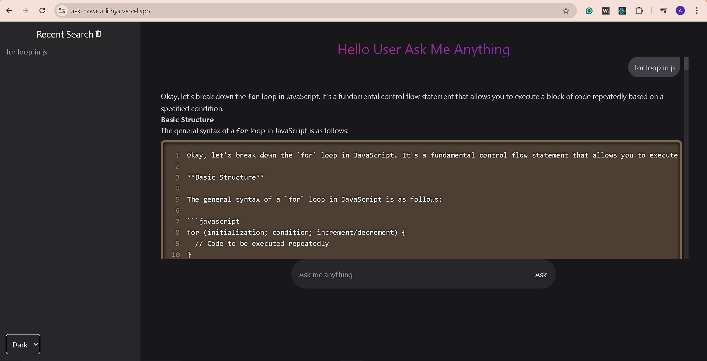

# Ask Nova – Your Personal AI Assistant

Ask Nova is an intelligent conversational AI tool — similar to **ChatGPT** or **Google Gemini** — designed to help you ask questions, generate ideas, write code, and get instant, human-like responses.  
Built with **React**, **Vite**, and **TailwindCSS**, Ask Nova provides a clean, fast, and modern chat interface for seamless AI conversations.

---

## 🖼️ Preview

> Here’s what Ask Nova looks like in action:



---

## What the Project Does

Ask Nova allows users to:
- 💬 Ask any question and receive detailed AI-generated answers.
-    Interact in a chat-like environment with **markdown** and **syntax-highlighted code** support.
- 🕓 Store and revisit **recent conversation history**.
- 🌗 Toggle between **Dark/Light modes** with persistent settings.
- 📜 Automatically scroll to the latest message for smooth chat flow.

Behind the scenes, Ask Nova connects to a **Generative AI API** (like Gemini or OpenAI) to process your questions and return natural, contextual responses.

---

## 🌟 Why the Project Is Useful

Ask Nova provides:
- 💻 A distraction-free environment to explore AI ideas.
- 🎨 A fully responsive interface with customizable dark/light themes.
- ⚡ Fast performance using **Vite + React + TailwindCSS**.
- 💬 Perfect for **developers, learners, and creators**.

It’s an open, flexible, and easy-to-extend AI client you can use for your own models or APIs.

---

## How Users Can Get Started

### 1️⃣ Clone the repositor
```bash
git clone https://github.com/Adithya-s-dev/ask-nova
cd ask-nova

### 2️⃣ Install dependencies
npm install

### 3️⃣ Set up your environment variables
VITE_API_URL="https://your-ai-endpoint"

### 4️⃣ Run the development server
npm run dev

Then open http://localhost:5173 in your browser 🚀

🌍 Deployment Guide
Deploy to Vercel

1.Go to Vercel.com
2.Import your GitHub repository.
3.Add your environment variable:
VITE_API_URL="https://your-ai-endpoint"
4.Click Deploy.
Your Ask Nova app will be live within seconds 🎉
